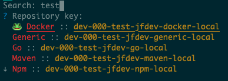

# JFrog CLI plugin - Set me up
## About this plugin
This plugin is a helpful tool to configure a local environment with certain repositories in Artifactory.

JFrog CLI Set me up supports both manual execution with a specific repository together with automatic 
configuration with a git stored config file. 

The config file can be shared with the team to allow easy environment configuration for the project. 

## Installation with JFrog CLI
Installing the latest version:

`$ jfrog plugin install setmeup`

Installing a specific version:

`$ jfrog plugin install setmeup@version`

Uninstalling a plugin

`$ jfrog plugin uninstall setmeup`

## Usage
### Commands
* `show` - Display all currently setup repository by reading configuration/environment
    - Example:
```
  $ jfrog setmeup show
  maven ::
	  rt         maven-local central
	  rt         maven-local snapshots
  go ::
	  rt         go-virtual
```

* `repository` - Set up your environment to use Artifactory repository
    - Arguments:
        - `repoKey` - The repository key you want to use, if not presented, a selection dropdown will be shown.
    - Flags:
        - `server-id`: The JFrog Platform you want to use, if not set then the default one is used
    - Example:
```
  $ jfrog setmeup repository go-virtual --server-id=arti1
  
  [Info] Setting up repository go-virtual of type go on https://entplus.jfrog.io/artifactory/
  [Info] Repo go-virtual set as GOPROXY
```

* `environment` - 
    - Arguments:
        - `repoKey` - The repository key you want to use, if not presented, a selection dropdown will be shown. 
    - Flags:
        - `server-id`: The JFrog Platform you want to use, if not set then the default one is used
        - `env-name`: The environment you want to use, if not set then the default one is used
    - Example:
```
  $ jfrog setmeup environment
```


* `apply` - 
    - Flags:
        - `server-id`: The JFrog Platform you want to use, if not set then the default one is used
        - `env-name`: The environment you want to use, if not set then the default one is used
    - Example:
```
  $ jfrog setmeup apply --server-id=arti1 --env-name=myenv
  
  [Info] Repo go-virtual set as GOPROXY
```

## Release Notes
The release notes are available [here](RELEASE.md).

## Contributing
Development instructions are available [here](CONTRIBUTING.md).
